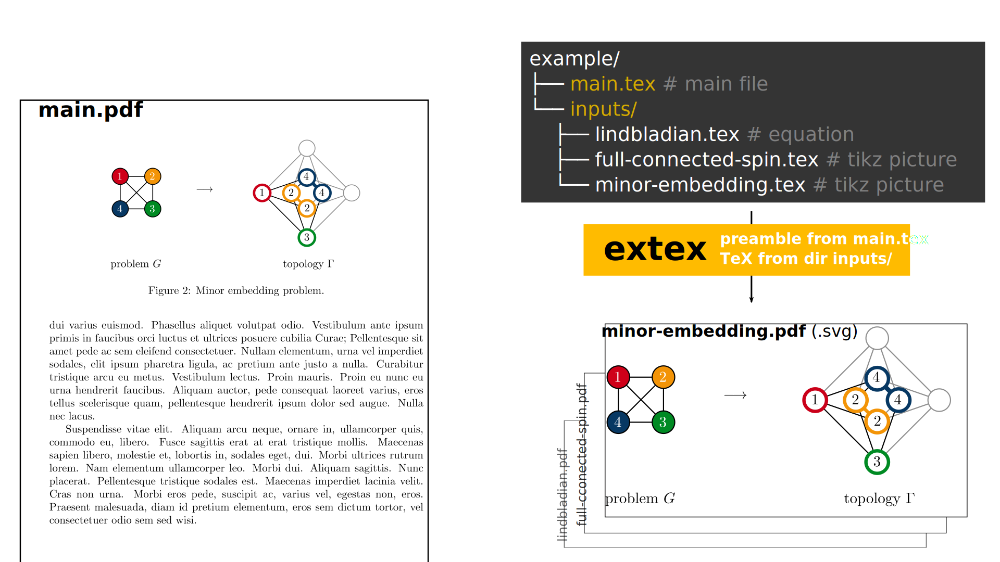

# extex

`extex` is a LaTeX extractor: it takes batches of input files and compiles them to pdf with tight page layout.
Additionally, the pdf file can be exported to svg.

The original **purpose** of this utility is to **compile batches of tikz pictures to pdf**, avoiding the overhead of compiling them from scratch in a full-scale project. 
Furthermore, the utility allows to **export the tikz pictures as svg files**, which can be imported in PowerPoint documents - or any other document that does not support pdf input.
Even though these are two prominent application examples, I am sure that you might find other creative ways of putting it to use.

To assure the best compatibility, **the LaTeX preamble is entirely customizable**. 
You might even use the same `main.tex` file of your source project: `extex` will take care of removing the document content (without touching your file) and use its preamble to compile the input files. 
This ensures the best rendition of the output, as it will use the same settings of your preamble/custom class.


### Requirements

* Linux-based OS.
* A **working LaTeX installation**. The script should be able to access a compiler (pdflatex/xelatex or any custom binary that can be specified via option).
* **[pdf2svg](https://archlinux.org/packages/extra/x86_64/pdf2svg/)** (optional) for svg conversion.


<br>

## How does it work

Suppose to have a LaTeX project like the one in the `example/` folder.
The [compiled document](example/main.pdf) shows two tikz figures and one equation, along with some text. 
The pictures and the equation are defined by TeX files placed in the directory `inputs/`, which are taken as input in the document `main.tex` file.

A run of `extex` iterates over all the TeX source files in the directory `inputs/`, combines them with the preamble of `main.tex`, and compiles each file to a separate pdf or svg file. Check out the outputs in [`example/extex-pdf`](example/extex-pdf/) ([`example/extex-svg`](example/extex-svg/)).



```bash
cd example/
extex inputs/ --svg --preamble main.tex
```

For more details about the command syntax, look at the [Usage](#usage) section.

### An even simpler example

The directory `example-minimal` contains an even smaller example, with a `main.tex` file defining the LaTeX document and a `test.tex` file with an equation. 
```bash
cd example-minimal/
extex test.tex --svg --preamble main.tex
```

<br>

## How to install

This utility can be used in two ways:
1. **Installation**: copy the `extex` script to a PATH directory. Doing so, the script can be invoked via terminal in any directory, on any project.
2. **Portable mode**: copy the `extex.sh` script to a directory of your choice and execute it. Obviously, this is not an installation.

Let me discuss at first the **installation procedure**. For the portable mode, just look at the [next subsection](#how-to-not-install-portable-mode).

**1)** Clone this repository:
```bash
git clone https://github.com/baronefr/extex.git
cd extex
```

**2)** Grant execution permit:
```bash
chmod +x extex.sh
```

**3)** Copy the script to a PATH directory. I suggest to use `~/.local/bin`.
```bash
cp extex.sh ~/.local/bin/extex
```

> [!NOTE]
> Notice that we have copied the script without the extension *.sh*. Doing so, we will be able to call the script as `extex`, without the extension.

Your script will now be accessible. I suggest running the following command to be sure that you are able to execute it. If no problem occurs, you should see the help menu.
```bash
extex --help
```

> [!WARNING]
> Be sure that the folder you choose is in your system PATH! To check if `~/.local/bin` is in your PATH, use the command
> ```bash
> if [[ ":$PATH:" == *":$HOME/.local/bin"* ]]; then echo 'yes'; else echo 'no'; fi
> ```
> The output should be yes (no) if the directory I suggested is (is not) in your PATH.
> If it is not present, edit your `.profile` or `.bashrc` file to [append it](https://unix.stackexchange.com/questions/26047/how-to-correctly-add-a-path-to-path).

<br>

### How to not install (portable mode)

If you wish to use this utility without installing, it is sufficient to copy the shell script to any destination.
```bash
git clone https://github.com/baronefr/extex.git
cp extex/extex.sh YOUR_DESTINATION/extex.sh
```

If you wish to skip the repository download, just use `wget`:
```bash
wget https://raw.githubusercontent.com/baronefr/extex/refs/heads/main/extex.sh
```

<br>

## Usage

> [!NOTE]
> An overview of the `extex` syntax is always available by prompting the `--help` flag.
> ```bash
> extex --help
> ```

`extex` takes a list of inputs, which is the list of TeX files to compile. Each of these inputs can **either be a file or a directory**.
```bash
extex inputs/ some-other-file.tex
# this will compile all the files in inputs/ and the file 'some-other-file.tex'
```
**If a directory is prompted**, `extex` will iterate over all the `*.tex` files contained in the directory. 
To change the selection rule of directories, use the `-r` (`--rule`) option. 
For instance, if you wish to compile all the `.tikz` files in directory inputs/, use the command `extex inputs -r '*.tikz'`.

### SVG

The conversion to svg files is optional. `extex` will compile the input files to pdf, using the LaTeX compiler; later, the pdf can be exported to svg, using the package [`pdf2svg`](https://archlinux.org/packages/extra/x86_64/pdf2svg/). To enable the final svg conversion step, use the flag `--svg` (`-s`):
```bash
extex --svg inputs/
```

### Preamble

The **name of the preamble file** is assumed by default to be `main.tex`, and it is expected to be placed in the pwd. 
If you wish to specify another preamble file, use the option `-p` (`--preamble`).
```bash
extex inputs/ --preamble another-main-file.tex
```

> [!NOTE]
> A preamble file is always required. `extex` does not automatically create a preamble file if nonexistent. You can create one yourself, it is not complex!
> ```latex
> \documentclass{article}
> % include required packages with \usepackage{...}
> ```

> [!NOTE]
> The preamble file can even be the document file of your LaTeX project. In this case, `extex` will extract only the preamble (i.e. everything that comes before `\begin{document}`) without touching the `main.tex` file at all.


### Output directories

`extex` places the output pdf (svg) files to directory `extex-pdf/` (`extex-svg/`) in pwd.
The directories are created if non-existent, and the files within it are overwritten without prompting to the user.

The name of the output directories can be customized with the options `--out-pdf` (`--out-svg`):
```bash
extex inputs/ --out-pdf custom-pdf-output/
```

The name of the output files is taken from the input files. For instance, the file `inputs/minor-embedding.tex` will be compiled to `extex-pdf/minor-embedding.pdf`.

### Compiler options

`extex` uses pdflatex by default. The compiler command can be specified via the `--compiler` (`-c`) flag:
```bash
extex inputs/ --compiler xelatex
# use xelatex
```
or
```bash
extex inputs/ --compiler /custom/compiler/executable
# use a custom binary file
```

The compiler is invoked with the following syntax:
```bash
compiler-cmd FLAGS -output-directory=.extex.build extex.tex
```
To customize the input FLAGS, use the option `--flags` (`-f`).

Please look at [the next section](#if-compilation-fails) to see how `extex` deals with **errors during the compilation process**.

### Debugging

The flag `-v` (`--verbose`) enables additional printings, which might help to figure out potential issues that occur in the utility execution.

#### If compilation fails

`extex` will output an error message (*compilation process failed*) if the LaTeX compiler returns a non-zero exit status. By default, the output of the compiler is suppressed to `\dev\null`.
However, if the compilation fails it might be useful to have a look at its outputs.
The flag `--no-quiet` will show the output of the compiler.
```bash
extex inputs/ --no-quiet
```
It might be wise to look at the compiler log (`main.log`, usually).

##### Additional debugging

When the execution is aborted, `extex` will not clean the temporary directories (`.extex.build/`) and files (`extex.tex`, `extex.template.tex`) that are used during the compilation process.
- `extex.tex` is passed to the compiler. Look here if there is some trouble.
- `extex.template.tex` should be a copy of the document preamble.
- `.extex.build/` is the directory that the compiler uses to build the project.

<br>

## Bug report

Feel free to open issues in case you experience troubles. 
It would be better to include terminal outputs with `--verbose` and `--no-quiet` flags.
I have tested this utility on Ubuntu and Fedora, though I do not expect troubles with other distributions.

## License

This software is released under [GNU GENERAL PUBLIC LICENSE](LICENSE).